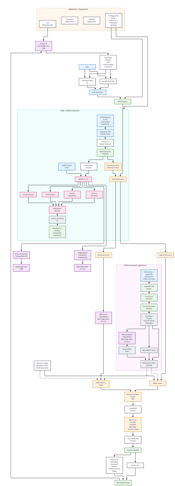

# Policy Document QA & Extraction Engine
## Evaluated Retrieval-Augmented Generation System for Enterprise Documents

A domain-agnostic Retrieval-Augmented Generation (RAG) system designed for high-accuracy question answering and information extraction from enterprise legal contracts, corporate policies, compliance documents, and other structured PDF-based document collections.

The system combines structure-aware document processing, dense semantic retrieval, sparse lexical retrieval, Reciprocal Rank Fusion (RRF), BGE cross-encoder reranking, grounded LLM generation, source attribution, and quantitative RAG evaluation using the CUAD dataset and RAGAS.

---

## 1. Project Overview

Large enterprise documents such as legal contracts, corporate policies, and compliance frameworks contain information that is distributed across sections, subsections, clauses, definitions, and page ranges.

Traditional keyword search can miss semantically related information, while unrestricted semantic retrieval can return passages from irrelevant sections or even unrelated documents.

This project addresses these challenges through a multi-stage RAG architecture that combines:

- Structure-aware PDF parsing
- Section-aware document chunking
- Dense semantic retrieval
- FAISS vector search
- BM25 sparse retrieval
- Reciprocal Rank Fusion
- BGE cross-encoder reranking
- Document-level filtering
- Context-aware prompt construction
- Groq-hosted LLM generation
- Source and page attribution
- CUAD-based evaluation
- RAGAS-based quality measurement
- Checkpointed and resumable evaluation

The result is an end-to-end document question-answering platform capable of retrieving relevant contractual evidence and generating grounded answers with traceable sources.

---

# 2. Key Objectives

The primary objectives of the project are:

1. Build a domain-agnostic RAG system for enterprise documents.
2. Preserve structural information during document processing.
3. Combine semantic and lexical retrieval approaches.
4. Improve retrieval precision using cross-encoder reranking.
5. Restrict evaluation retrieval to the correct source contract.
6. Generate answers grounded in retrieved evidence.
7. Provide document, section, and page-level source information.
8. Quantitatively evaluate the RAG pipeline using RAGAS.
9. Use CUAD as a benchmark for contract understanding.
10. Provide a modular architecture suitable for future production deployment.

---

# 3. Complete System Architecture

The following diagram represents the complete architecture of the implemented system, including document ingestion, indexing, hybrid retrieval, reranking, answer generation, and evaluation.




The architecture consists of two major workflows:

### Online Question Answering

```text
User Question
      |
      v
RAG Pipeline
      |
      v
Hybrid Retrieval
      |
      +--------------------+
      |                    |
      v                    v
Dense Retrieval        Sparse Retrieval
FAISS                  BM25
      |                    |
      +---------+----------+
                |
                v
       Reciprocal Rank Fusion
                |
                v
       BGE Cross-Encoder
           Reranking
                |
                v
        Top-K Context
                |
                v
        Context Builder
                |
                v
             Groq LLM
                |
                v
       Grounded Answer
                |
                v
       Source Attribution
